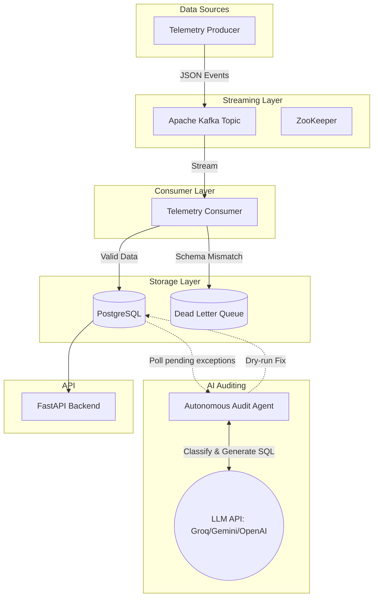

# Supply Chain GenAI Platform

A real-time, enterprise-grade Supply Chain Operations platform that combines **Streaming Data Engineering (Kafka, Postgres)** with **Generative AI (LangChain, Any LLM)** to enable intelligent auditing, real-time telemetry validation, and automated exception handling.

## 🚀 Key Features

*   **Real-time Streaming Pipeline**: Uses Kafka to stream logistics and inventory events asynchronously.
*   **Data Quality & Validation**: Strict Pydantic schemas validate all incoming messages. Invalid messages are actively intercepted and routed to a Postgres **Dead Letter Queue (DLQ)**.
*   **Data Lineage Tracking**: Every message is tagged with a `source_id`, `ingestion_timestamp`, and `transform_version` to maintain end-to-end auditability.
*   **Autonomous Audit Agent**: A LangChain-powered AI agent continuously monitors exceptions. It categorizes issues and autonomously drafts SQL fixes (in a dry-run state) for supervisor approval.
*   **LLM Agnostic**: Configure `.env` to plug and play your preferred LLM provider (`OpenAI`, `Google Gemini`, or `Groq` for high-speed open-source models).
*   **Demand Forecasting & Routing**: A FastAPI backend exposes endpoints for SARIMA-based demand forecasting and heuristic vehicle route optimization.

## 🏛️ Architecture



## 📁 Repository Structure

```
├── api/
│   └── main.py                     # FastAPI backend (Forecasting, Routing, Health)
├── streaming/
│   ├── telemetry_producer.py       # Simulates streaming from CSV to Kafka
│   └── telemetry_consumer.py       # Validates schema and inserts into Postgres/DLQ
├── agents/
│   ├── autonomous_audit_agent.py   # LLM Agent for fixing exceptions
│   ├── triage_bot.py               # Conversational SQL Bot
│   └── kb_maker.py                 # Vector DB builder for RAG
├── infrastructure/
│   ├── init.sql                    # Postgres Schema & DLQ definitions
│   └── dashboard_views.sql         # SQL Views for BI tools (Tableau/PowerBI)
├── notebooks/                        # EDA, Route Optimization, Inventory Notebooks
├── docker-compose.yml              # Kafka, Zookeeper, Postgres environment
└── .env.example                    # Template for LLM API keys
```

## ⚙️ Getting Started

### 1. Start the Infrastructure
Make sure Docker is installed. Spin up Kafka, Zookeeper, and Postgres:
```bash
docker-compose up -d
```
*Note: Postgres is mapped to port `5433` by default to avoid conflicts with local instances.*

### 2. Configure Environment
Copy the example environment file and add your preferred LLM API key.
```bash
cp .env.example .env
```
Edit `.env` to set `LLM_PROVIDER` (`groq`, `openai`, or `gemini`) and supply the corresponding API key.

### 3. Install Dependencies
```bash
pip install -r requirements.txt
```

### 4. Run the Pipeline

Run these scripts in separate terminal windows to see the system in action:

**A. Start the API (Terminal 1)**
```bash
python api/main.py
```
> View the swagger documentation at `http://localhost:8000/docs`

**B. Start the Consumer (Terminal 2)**
```bash
python streaming/telemetry_consumer.py
```
> Listens to Kafka and validates data in real-time.

**C. Start the Audit Agent (Terminal 3)**
```bash
python agents/autonomous_audit_agent.py
```
> The agent will begin polling the DLQ/Exceptions table.

**D. Stream Data (Terminal 4)**
```bash
python streaming/telemetry_producer.py
```
> Starts pushing events to Kafka. Watch Terminal 2 log successful inserts and Terminal 3 catch and categorize any malformed anomalies!

## 🧪 Testing & Validation Example Output

When running the producer, it intentionally sends a malformed event.
The **Consumer** output catches this:
```
Logged to DLQ for payload: {'event_type': 'logistics_telemetry', 'data': {'Order ID': 'BAD_ORDER', 'Order Value': 'NotANumber'}}
```

The **Audit Agent** picks it up immediately:
```
Analyzing exception ID 1...
Decision: FIXABLE_AUTO
Reasoning: The order value 'NotANumber' is a clear data entry error. Setting to 0 pending supervisor review.
Generated SQL: UPDATE logistics_telemetry SET order_value = 0 WHERE order_id = 'BAD_ORDER'
[DRY RUN] Executed SQL successfully.
---> [ACTION REQUIRED] Sent notification to Supervisor for Approval of SQL
```
